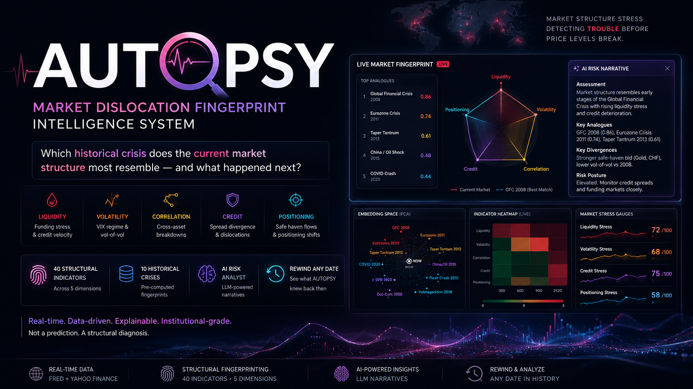

# 🔬 AUTOPSY
### Market Dislocation Fingerprint Intelligence System

> *"Which historical crisis does the current market structure most resemble — and what happened next?"*

[](https://huggingface.co/spaces/ARKAISW/Autopsy)
---

## What Is AUTOPSY?

AUTOPSY is a real-time market stress intelligence system that detects structural fingerprints in financial markets and matches them against 10 historical crises — before price-level stress makes the danger obvious.

It analyzes **40 market indicators** across 5 structural dimensions:

| Dimension | What It Captures |
|---|---|
| 🔴 Liquidity | TED spread, credit spread velocity, yield curve shape |
| 🟠 Volatility | VIX level, term structure inversion, vol-of-vol |
| 🟡 Correlation | Cross-asset correlation breakdown, safe haven flows |
| 🟣 Credit | HY/IG spread divergence, financials vs market |
| 🔵 Positioning | Gold/Yen/CHF flows, defensive rotation, EM outflows |

These are compared against pre-crisis fingerprints from:
**LTCM 1998 · Dot-Com 2000 · GFC 2008 · Flash Crash 2010 · Eurozone 2011 · Taper Tantrum 2013 · China/Oil 2015 · Volmageddon 2018 · COVID 2020 · SVB 2023**

An AI analyst then reads the fingerprint match and writes a structured institutional risk narrative using any OpenAI-compatible LLM (Groq, Gemini, OpenRouter, Ollama, etc.).

**This is not a price prediction tool. It is a market structure stress detector.**

---

## How It Works

```
Live Market Data (FRED + Yahoo Finance)
        │
        ▼
40 Indicator Computation (rolling z-scores, velocities, correlations)
        │
        ▼
Fingerprint Vector (RobustScaler normalized, 40-dimensional)
        │
        ▼
Cosine Similarity vs 10 Historical Crisis Fingerprints
        │
        ▼
AI Narrative (LLM reads pre-computed results, writes risk brief)
        │
        ▼
Live Dashboard (Radar · Analogues · Embedding Space · Heatmap · Rewind)
```

The math does the analysis. The AI writes the explanation. Every number is traceable to a public data source.

---

## Features

- **Live Mode** — current market fingerprint updated daily
- **Rewind Mode** — set any historical date and see what AUTOPSY would have shown
- **Heatmap Mode** — 40-indicator stress heatmap over 30/60/90/252 day windows
- **Embedding Space** — 2D PCA projection showing where "NOW" sits relative to historical crises
- **AI Risk Narrative** — structured 4-section brief: Assessment · Analogues · Divergences · Risk Posture

---

## Quickstart

### 1. Clone
```bash
git clone https://github.com/ARKAISW/autopsy.git
cd autopsy
```

### 2. Install
```bash
python -m venv .venv
source .venv/bin/activate      # Windows: .venv\Scripts\activate
pip install -r requirements.txt
```

### 3. API Keys
Create an environment file for local use:

```bash
cp .env.example .env
# Open .env and fill in your keys
```


### 4. Run
```bash
streamlit run dashboard/app.py
```

---

## Getting API Keys (Both Free)

| Key | Where to Get It | Cost |
|---|---|---|
| `FRED_API_KEY` | [fred.stlouisfed.org/docs/api/api_key.html](https://fred.stlouisfed.org/docs/api/api_key.html) | Free, instant |
| `LLM_API_KEY` | [Groq](https://console.groq.com) · [Gemini](https://aistudio.google.com) · [OpenRouter](https://openrouter.ai) | Free tier available |

Configure your LLM provider in `.env`:
```env
LLM_BASE_URL=https://api.groq.com/openai/v1
LLM_API_KEY=your_key_here
LLM_MODEL=llama-3.3-70b-versatile
```

Any OpenAI-compatible API works — Groq, Google Gemini, OpenRouter, Together AI, Ollama (local), LM Studio (local), or OpenAI.

---

## Data Sources

### FRED (Federal Reserve Economic Data)
| Series | FRED ID | Link |
|---|---|---|
| TED Spread | TEDRATE | [→](https://fred.stlouisfed.org/series/TEDRATE) |
| HY Credit Spread (OAS) | BAMLH0A0HYM2 | [→](https://fred.stlouisfed.org/series/BAMLH0A0HYM2) |
| IG Credit Spread (OAS) | BAMLC0A0CM | [→](https://fred.stlouisfed.org/series/BAMLC0A0CM) |
| 10Y-2Y Yield Curve | T10Y2Y | [→](https://fred.stlouisfed.org/series/T10Y2Y) |
| 10Y-3M Yield Curve | T10Y3M | [→](https://fred.stlouisfed.org/series/T10Y3M) |
| VIX Index | VIXCLS | [→](https://fred.stlouisfed.org/series/VIXCLS) |

### Yahoo Finance
SPY · QQQ · IEF · LQD · HYG · GLD · USO · UUP · EEM · XLF · XLE · XLU · ^VIX · ^VIX3M · ^VIX9D · EURUSD=X · JPY=X · CHF=X

---

## Project Structure

```
autopsy/
├── data/
│   ├── pipeline.py          # FRED + yfinance data fetching
│   ├── indicators.py        # 40 indicator computations
│   └── crisis_library.py    # 10 historical crisis definitions
├── fingerprint/
│   ├── engine.py            # Fingerprint extraction + similarity
│   └── embedding.py         # PCA embedding for visualization
├── agent/
│   └── analyst.py           # Universal LLM analyst (OpenAI-compatible)
├── dashboard/
│   ├── app.py               # Main Streamlit app
│   ├── charts.py            # All Plotly chart functions
│   └── state.py             # Session state management
└── requirements.txt
```


## Disclaimer

AUTOPSY is a research and educational tool. It does not constitute investment advice. All data is sourced from public APIs. Past crisis structural patterns do not guarantee future market behavior.

---

## Author

**Arka Sarkar**
[GitHub](https://github.com/ARKAISW) · TechEx Intelligent Enterprise Solutions Hackathon 2026

---

*Data: FRED (Federal Reserve Bank of St. Louis) + Yahoo Finance · AI: Any OpenAI-compatible LLM*
